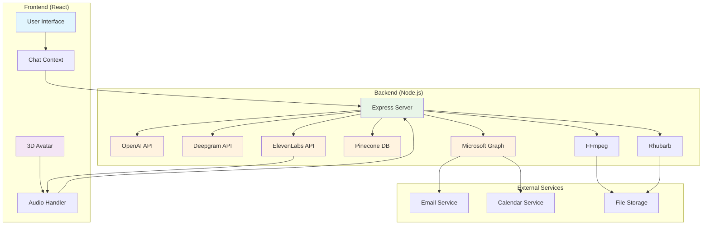
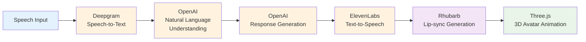
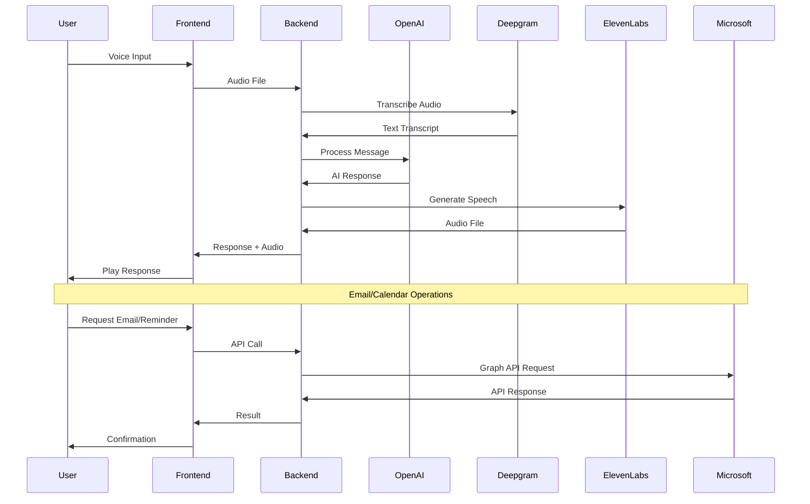

# 3D Virtual Assistant

An interactive, avatar-based virtual assistant powered by AI that combines speech recognition, natural language processing, and 3D animations to create a seamless user experience.


[🎥 Watch Project Demo](https://youtu.be/PwOG_xu2Bh0)

## ✨ Features

- **🗣️ Voice Interaction**: Speech-to-text and text-to-speech capabilities using Deepgram and ElevenLabs
- **🤖 AI Responses**: Powered by OpenAI GPT for intelligent conversation and task handling
- **🎭 3D Avatar**: Real-time facial animations and lip-sync using Three.js and React Three Fiber
- **📧 Email Integration**: Send and manage emails through Microsoft Graph API
- **📝 Note Taking**: Transcribe audio and take intelligent notes
- **⏰ Reminders**: Set and manage reminders with natural language
- **🔍 Knowledge Base**: RAG (Retrieval-Augmented Generation) for information retrieval
- **🎯 Gesture Animations**: Synchronized hand and facial gestures for enhanced engagement

## 🏗️ Architecture

The project consists of two main components:

### Backend (Node.js)
- **Express.js** server for API endpoints
- **OpenAI** integration for AI responses
- **Deepgram** for speech-to-text
- **ElevenLabs** for text-to-speech
- **Pinecone** for vector database and RAG
- **Microsoft Graph API** for email functionality
- **Rhubarb** for lip-sync generation

### Frontend (React)
- **React 18** with Vite for fast development
- **Three.js** and React Three Fiber for 3D graphics
- **Tailwind CSS** for styling
- **Axios** for API communication

## � System Architecture Diagram



## �🚀 Quick Start

### Prerequisites
- Node.js (v16 or higher)
- npm or yarn
- API keys for various services (see Environment Variables)

### Installation

1. **Clone the repository**
   ```bash
   git clone https://github.com/yourusername/3D_Virtual_Assistant.git
   cd 3D_Virtual_Assistant
   ```

2. **Backend Setup**
   ```bash
   cd Backend
   npm install
   # or
   yarn install
   ```

3. **Frontend Setup**
   ```bash
   cd ../Frontend
   npm install
   # or
   yarn install
   ```

4. **Download Required Binaries**
   - Download **RhubarbLibrary** for your OS from [releases](https://github.com/DanielSWolf/rhubarb-lip-sync/releases)
   - Place the executable in `Backend/bin/rhubarb`
   - Download **FFmpeg** and place in `Backend/bin/ffmpeg`

5. **Environment Configuration**
   ```bash
   cd Backend
   cp .env.example .env
   # Edit .env with your API keys
   ```

### Running the Application

1. **Start the Backend**
   ```bash
   cd Backend
   npm run dev
   # or
   yarn dev
   ```

2. **Start the Frontend**
   ```bash
   cd Frontend
   npm run dev
   # or
   yarn dev
   ```

3. **Access the Application**
   - Frontend: http://localhost:5173
   - Backend API: http://localhost:3000

## 🔧 Configuration

The project uses a centralized configuration system to manage paths, API settings, and application parameters.

### Main Configuration File

Create a `config.json` file at the root of the repository with the following structure:

```json
{
  "paths": {
    "root": ".",
    "backend": "./Backend",
    "frontend": "./Frontend",
    "audioFiles": "./Backend/audios",
    "binaries": "./Backend/bin",
    "ffmpeg": "./Backend/bin/ffmpeg",
    "rhubarb": "./Backend/bin/rhubarb"
  },
  "server": {
    "port": 3000,
    "host": "localhost"
  },
  "api": {
    "openai": {
      "model": "gpt-3.5-turbo-1106",
      "maxTokens": 1000,
      "temperature": 0.6
    },
    "elevenLabs": {
      "voiceID": "cgSgspJ2msm6clMCkdW9"
    },
    "deepgram": {
      "apiUrl": "https://api.deepgram.com/v1/listen"
    }
  },
  "assistant": {
    "name": "Virtual Assistant",
    "context": "You are a personal assistant for Purdue Fort Wayne University students.",
    "facialExpressions": ["smile", "sad", "angry", "surprised", "funnyFace", "default"],
    "animations": ["Talking_0", "Talking_1", "Talking_2", "Crying", "Laughing", "Rumba", "Idle", "Terrified", "Angry"]
  },
  "fileFormats": {
    "audio": {
      "input": "mp3",
      "output": "wav",
      "lipSync": "json"
    }
  }
}
```

### Environment Variables

Create a `.env` file in the `Backend` directory with the following variables:

```env
OPENAI_API_KEY=your_openai_api_key
ELEVEN_LABS_API_KEY=your_elevenlabs_api_key
DEEPGRAM_API_KEY=your_deepgram_api_key
PINECONE_API_KEY=your_pinecone_api_key
PINECONE_ENVIRONMENT=your_pinecone_environment
CLIENT_ID=your_microsoft_app_client_id
CLIENT_SECRET=your_microsoft_app_client_secret
TENANT_ID=your_microsoft_tenant_id
USER_EMAIL=your_email_for_access
```

## 📁 Project Structure

```
3D_Virtual_Assistant/
├── Backend/
│   ├── bin/                    # Binary executables (ffmpeg, rhubarb)
│   ├── audios/                 # Audio files storage
│   ├── index.js               # Main server file
│   ├── package.json           # Backend dependencies
│   └── .env.example           # Environment variables template
├── Frontend/
│   ├── public/                # Static assets
│   ├── src/                   # React source code
│   ├── package.json           # Frontend dependencies
│   └── vite.config.js         # Vite configuration
└── README.md                  # This file
```

## 🛠️ Technologies Used

### Backend
- **Node.js** - Runtime environment
- **Express.js** - Web framework
- **OpenAI** - AI language model
- **Deepgram** - Speech recognition
- **ElevenLabs** - Voice synthesis
- **Pinecone** - Vector database
- **Microsoft Graph API** - Email integration
- **Multer** - File handling
- **Axios** - HTTP client

### Frontend
- **React 18** - UI framework
- **Three.js** - 3D graphics
- **React Three Fiber** - React renderer for Three.js
- **React Three Drei** - Helpers for React Three Fiber
- **Vite** - Build tool
- **Tailwind CSS** - CSS framework
- **Axios** - HTTP client

## 🎯 Core Functionality

### Voice Processing Pipeline


### Data Flow Architecture


### Task Management
- **Email Operations**: Send, read, and manage emails
- **Reminder System**: Set and track reminders
- **Note Taking**: Transcribe and organize notes
- **Knowledge Retrieval**: RAG-based information access

### API Endpoints
```mermaid
graph LR
    subgraph "Backend API"
        Chat[/chat]
        Transcript[/transcript]
        RAG[/rag]
        Event[/createEvent]
        Email[/sendEmail]
        Voices[/voices]
    end
    
    subgraph "Functions"
        AI[AI Chat]
        STT[Speech-to-Text]
        KB[Knowledge Base]
        Cal[Calendar Events]
        Mail[Email Sending]
        VoiceList[Voice Options]
    end
    
    Chat --> AI
    Transcript --> STT
    RAG --> KB
    Event --> Cal
    Email --> Mail
    Voices --> VoiceList
    
    style Chat fill:#e3f2fd
    style Transcript fill:#e3f2fd
    style RAG fill:#e3f2fd
    style Event fill:#e3f2fd
    style Email fill:#e3f2fd
    style Voices fill:#e3f2fd
```

## 🤝 Contributing

1. Fork the repository
2. Create a feature branch (`git checkout -b feature/AmazingFeature`)
3. Commit your changes (`git commit -m 'Add some AmazingFeature'`)
4. Push to the branch (`git push origin feature/AmazingFeature`)
5. Open a Pull Request

## 📄 License

This project is licensed under the MIT License - see the [LICENSE](LICENSE) file for details.

## 🙏 Acknowledgments

- [OpenAI](https://openai.com/) for powerful language models
- [Deepgram](https://deepgram.com/) for accurate speech recognition
- [ElevenLabs](https://elevenlabs.io/) for realistic voice synthesis
- [Three.js](https://threejs.org/) for 3D graphics capabilities
- [Rhubarb](https://github.com/DanielSWolf/rhubarb-lip-sync) for lip-sync technology

## 📞 Support

If you have any questions or need support, feel free to open an issue in the repository.

---

**Note**: This project requires API keys from multiple services. Please ensure you have proper API access before running the application.

